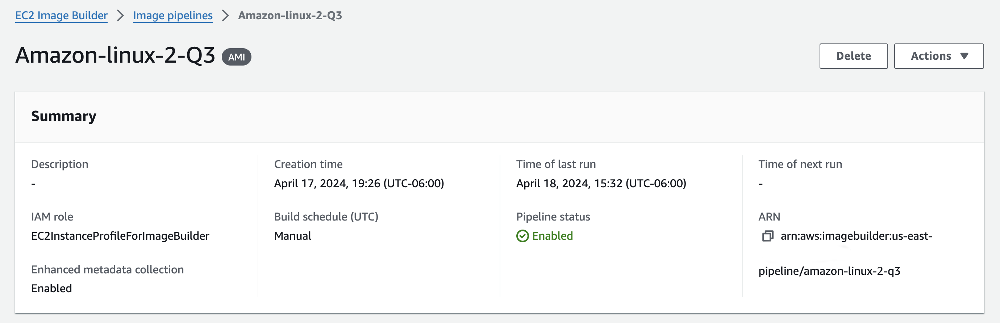

# EC2-Image-Builder


## Prerequisites

You must have the following installed and/or configured beforehand:

- Terraform
- A VPC with a private subnet tagged `Tier = Private`
- Permissions to create a new role in AWS
- AWS CLI

## What is EC2 Image Builder?

EC2 Image Builder is a service from Amazon Web Services (AWS) that helps you create, maintain, and deploy operating system images for your Amazon EC2 instances. Manually performing these tasks each time you need a new instance would be an endless and error-prone task. EC2 Image Builder automates the entire process so you can focus on more important aspects of your work.

## How Does It Work?

Think of EC2 Image Builder like cooking. You need a recipe (your image configuration), ingredients (the operating system and applications), and a cooking process (automation). EC2 Image Builder acts as your personal chef, following the recipe precisely, ensuring all ingredients are fresh and well-mixed, and delivering a perfect result every time.

## Use Cases for EC2 Image Builder

- **Creating Base Images**
- **Maintaining Secure Images**
- **Deploying Applications**
- **Standardizing Environments**
- **Continuous Integration and Continuous Delivery (CI/CD)**
- **Compliance and Auditing**

## Key Features of EC2 Image Builder

- **Image Pipelines**: Automates the creation of images with pipelines that include everything from sources to tests.
- **Reusable Components**: Use predefined or custom components to add software, configurations, and scripts to your images.
- **Integration with Other AWS Services**: Seamlessly works with services like AWS Systems Manager, AWS IAM, and AWS CloudTrail to manage permissions, audits, and automation.
- **Automated Testing**: Validate your images with automated tests before deployment to ensure everything works as expected.
- **Distribution**: Simplifies the distribution of images to different AWS regions and accounts.

For more information, visit the [AWS EC2 Image Builder documentation](https://docs.aws.amazon.com/imagebuilder/latest/userguide/what-is-image-builder.html).

# Install

## Terraform Configuration

### Files and Structure

- **main.tf**: Defines the EC2 Image Builder module.
- **variables.tf**: Defines input variables for the Terraform configuration.
- **outputs.tf**: Specifies outputs for the Terraform configuration.
- **backend.tf**: Configures the Terraform backend and providers.
- **module/main.tf**: Contains the resources for creating the EC2 Image Builder pipeline, distribution configuration, image recipe, and infrastructure configuration.
- **module/variables.tf**: Defines input variables specific to the module.

### How to Use

1. **Initialize Terraform**: This command initializes the Terraform configuration.

   ```sh
   terraform init
   ```

2. **Plan the Deployment**: This command generates and shows an execution plan.

   ```sh
   terraform plan
   ```

3. **Apply the Configuration**: This command applies the changes required to reach the desired state of the configuration.

   ```sh
   terraform apply
   ```

4. **If you need create a new AMI Versión Execute**

```sh
./createAmiAl2
```

## Script

```bash
#!/usr/bin/env bash
set -e

# Validate Terraform files
terraform init
terraform validate
terraform plan
terraform apply -auto-approve

output_value=$(terraform output -raw ami_id)
echo "Output value: ${output_value}"
amiId=""
# Init creation AMI
initCreationAmi=$(aws imagebuilder start-image-pipeline-execution --image-pipeline-arn ${output_value} --query "imageBuildVersionArn" --output text)
echo "New Building AMI: ${initCreationAmi}"
# Status Creation AMI
statusAmi=$(aws imagebuilder get-image --image-build-version-arn "${initCreationAmi}" --query "image.state.status" --output text)

# Status Creation AMI for Amazon Linux 2
while [[ "${statusAmi}" == "BUILDING" || "${statusAmi}" == "TESTING" ]]; do
    echo "Creating new GOLDEN AMI for Amazon Linux 2 - Status: ${statusAmi}"
    statusAmi=$(aws imagebuilder get-image --image-build-version-arn "${initCreationAmi}" --query "image.state.status" --output text)

  if [[ "${statusAmi}" == "AVAILABLE" ]]; then
    echo "New status for Creation AMI: ${statusAmi}"
    amiId=$(aws imagebuilder get-image --image-build-version-arn "${initCreationAmi}" --query "image.outputResources.amis[].image" --output text)
    echo "AMI ID: ${amiId}"
    break
  elif [[ "${statusAmi}" == "FAILED" ]]; then
    echo ""
    echo ""
    echo "Error creating new GOLDEN AMI"
    echo "Status: ${statusAmi}"
    echo ""
    echo ""
    exit 1
  fi

  sleep 60
done
```



### Root Configuration

- **main.tf**:
  ```hcl
  module "ec2_builder_image_al2" {
    source       = "./module"
    name         = var.name
    versioning   = "v1"
    current_year = "2024"
    vpc_id       = var.vpc
    image_id     = data.aws_ami.amazon_linux_2.id
    region       = local.region
  }
  ```
